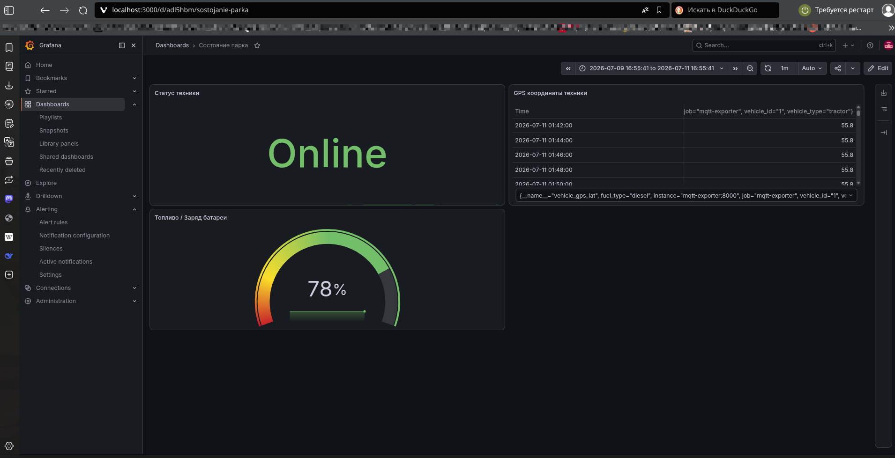
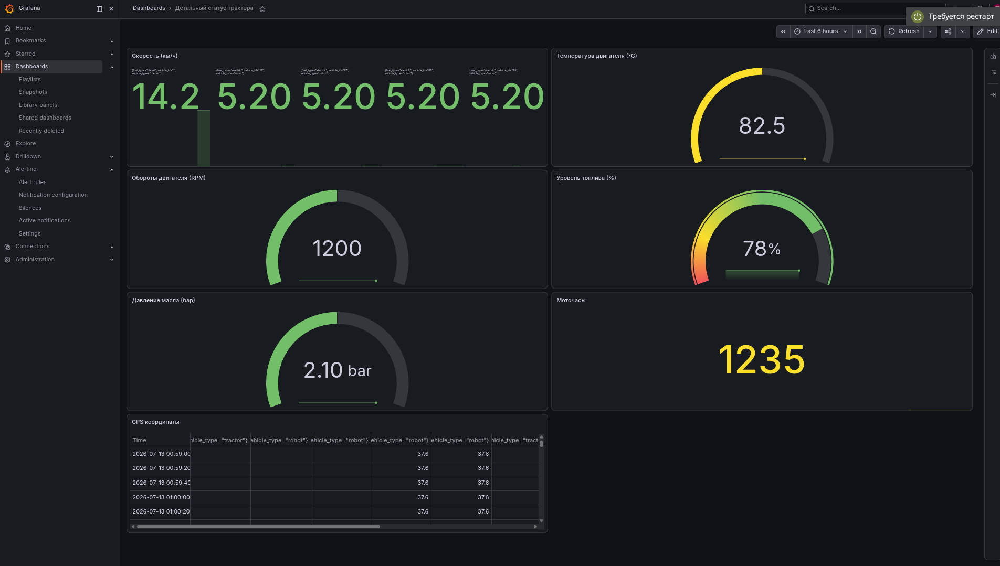
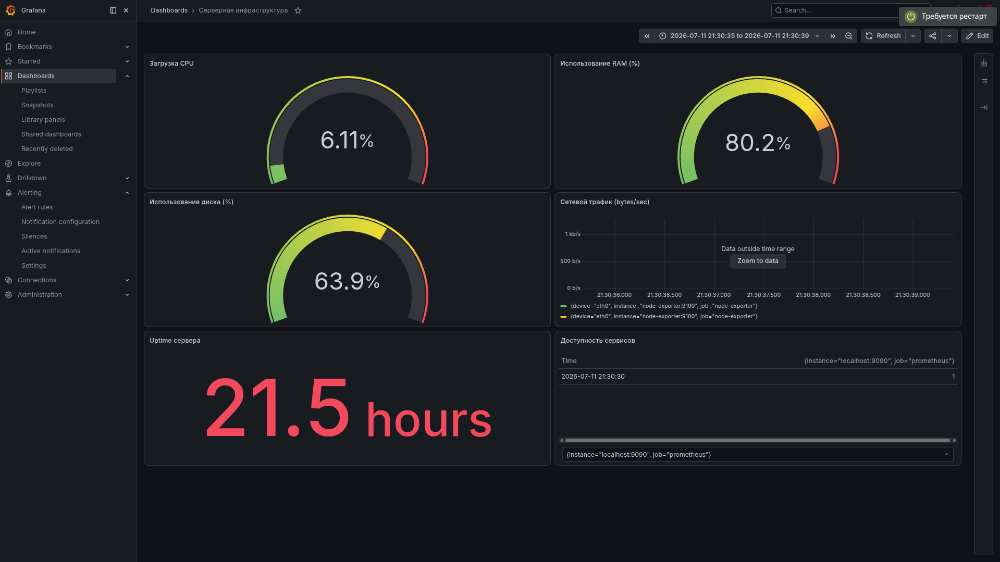
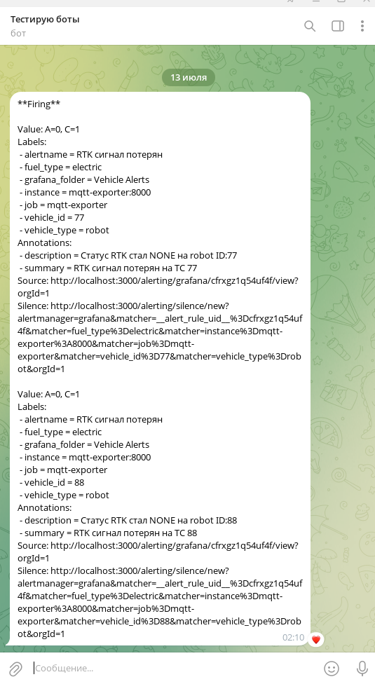
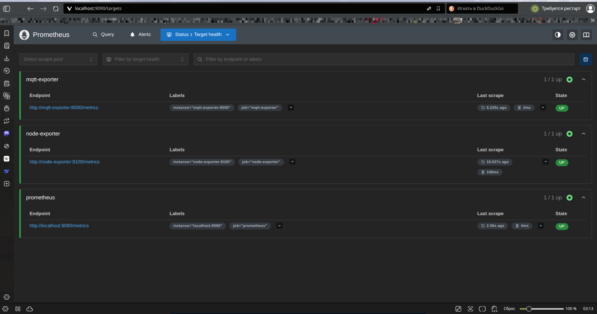

# Apriori Monitoring System

Система мониторинга транспортных средств на базе Prometheus + Grafana.

## 📋 Описание

Система предназначена для сбора, хранения и визуализации телеметрии от различных типов транспортных средств:
- Дизельная техника (тракторы, комбайны)
- Электрическая техника (роботы, погрузчики)
- Автономные роботы с RTK-GPS

## ️ Архитектура

```
┌─────────────┐     ──────────────┐     ┌─────────────┐
│   Vehicle   │────▶│   Mosquitto  │────▶│ MQTT        │
│  Telemetry  │ MQTT│   (MQTT)     │     │ Exporter    │
└─────────────┘     └──────────────┘     └─────────────┘
                                                │
                                                ▼
                                         ┌─────────────┐
                                         │ Prometheus  │
                                         │ (Metrics)   │
                                         └─────────────┘
                                                │
                                                ▼
                                         ┌─────────────┐
                                         │ Grafana     │
                                         │ (Dashboard) │
                                         └─────────────┘
```

```
## 🛠 Используемые технологии

| Компонент | Версия | Назначение |
|-----------|--------|------------|
| Docker | 29.6.1 | Контейнеризация |
| Docker Compose | 5.3.1 | Оркестрация контейнеров |
| Mosquitto | 2.1.2 | MQTT брокер |
| Python | 3.14.6 | MQTT экспортер |
| Prometheus | latest | Сбор метрик |
| Grafana | latest | Визуализация и алертинг |
| Node Exporter | latest | Мониторинг хоста |
| paho-mqtt | 2.1.0 | Python MQTT клиент |
| prometheus_client | 0.25.0 | Python Prometheus клиент |
```


## 🚀 Быстрый старт

### Требования
- Docker >= 20.10 (протестировано на 29.6.1)
- Docker Compose >= 2.0 (протестировано на 5.3.1)
- Python 3.11+ (протестировано на 3.14.6)
- Git

### Установка

1. Клонируйте репозиторий:
```bash
git clone https://github.com/Myth3916/apriori-monitoring
cd apriori-monitoring
```

2. Запустите систему:
```bash
docker-compose up -d
```

3. Откройте браузер:
- **Grafana**: http://localhost:3000 (admin/admin)
- **Prometheus**: http://localhost:9090
- **Mosquitto**: localhost:1883

## 📊 Компоненты

### Mosquitto (MQTT Broker)
- Порт: 1883 (MQTT), 9001 (WebSocket)
- Принимает телеметрию от ТС

### MQTT Exporter
- Порт: 8000
- Преобразует MQTT сообщения в Prometheus-метрики

### Prometheus
- Порт: 9090
- Собирает и хранит метрики 30 дней

### Grafana
- Порт: 3000
- Визуализация данных и алертинг

##  Формат телеметрии

### Пример сообщения для трактора:
```json
{
  "schema_version": 1,
  "vehicle_id": "1",
  "vehicle_type": "tractor",
  "fuel_type": "diesel",
  "timestamp": 1700000000000,
  "metrics": {
    "gps_lat": 55.7558,
    "gps_lon": 37.6173,
    "speed_kmh": 14.2,
    "engine_status": "on",
    "engine_rpm": 1200,
    "fuel_level_pct": 78,
    "temp_c": 82.5,
    "oil_pressure_bar": 2.1,
    "engine_hours": 1234.5
  },
  "events": []
}
```

### Топики MQTT:
- `{vehicle_type}/{fuel_type}/{vehicle_id}/telemetry`
- Пример: `tractor/diesel/1/telemetry`

## 📈 Дашборды

### 1. Состояние парка
- Общий статус техники
- GPS координаты
- Уровень топлива/заряда батареи

### 2. Детальный статус трактора
- Скорость, температура, обороты
- Давление масла, моточасы
- GPS координаты

### 3. Серверная инфраструктура
- Загрузка CPU/RAM
- Использование диска
- Сетевой трафик

## 📸 Скриншоты

### Дашборд "Состояние парка"


### Дашборд "Детальный статус трактора"


### Дашборд "Серверная инфраструктура"


### Уведомления в Telegram


### Prometheus Targets



## 🚨 Алерты

### Настроенные алерты:
1. **Высокая температура CPU** (> 75°C)
2. **RTK сигнал потерян** (статус = none > 30 сек)
3. **Потеря связи с ТС** (> 5 минут)

### Уведомления:
- Telegram бот
- Email (настраивается)

## 🔧 Конфигурация

### Переменные окружения

#### MQTT Exporter:
```bash
MQTT_BROKER=mosquitto
MQTT_PORT=1883
MQTT_TOPIC=#
HTTP_PORT=8000
```

## 🧪 Тестирование

### Отправка тестовых данных:
```bash
docker exec mosquitto mosquitto_pub -h localhost -p 1883 \
  -t "tractor/diesel/1/telemetry" \
  -m '{"schema_version":1,"vehicle_id":"1","vehicle_type":"tractor","fuel_type":"diesel","timestamp":1700000000000,"metrics":{"gps_lat":55.7558,"gps_lon":37.6173,"speed_kmh":14.2,"engine_status":"on","engine_rpm":1200,"fuel_level_pct":78,"temp_c":82.5,"oil_pressure_bar":2.1,"engine_hours":1234.5},"events":[]}'
```

## 📝 Разработка

### Локальный запуск экспортера:
```bash
cd mqtt-exporter
pip install -r requirements.txt
python mqtt_exporter.py
```

## 🐛 Troubleshooting

### Контейнер не запускается:
```bash
docker-compose logs <service_name>
```
```
### Ошибка "Отказано в доступе" для mosquitto/data/
Это нормально — папка принадлежит пользователю Mosquitto внутри контейнера (UID 1883).
Git игнорирует её через .gitignore, поэтому на работу системы это не влияет.
```

### Метрики не появляются:
1. Проверьте логи MQTT экспортера: `docker-compose logs mqtt-exporter`
2. Убедитесь, что Mosquitto принимает сообщения
3. Проверьте подключение в Prometheus: http://localhost:9090/targets

### Алерты не срабатывают:
1. Проверьте настройки Contact Points в Grafana
2. Убедитесь, что метрики есть в Prometheus
3. Проверьте правила алертов

## 📄 Лицензия

MIT License

## 👥 Контакты

Шаров Олег <os127@yandex.ru>
